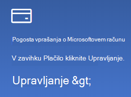

# Spreminjanje podatkov Microsoftovega računa

Pojdite v [https://account.microsoft.com](https://account.microsoft.com/) in se po potrebi vpišite. Premaknili se boste na nadzorno ploščo računa.  

**Urejanje imena in osebnih podatkov**

1. Na nadzorni plošči računa ob sliki in imenu računa kliknite možnost **Več dejanj > Urejanje profila**.
2. Na strani **Urejanje profila** s povezavami, ki so na voljo, spremenite sliko profila, ime, datum rojstva, lokacijo in jezikovne nastavitve prikaza. Upoštevajte povezave do profilov računa Xbox ali Skype, kjer lahko spremenite podrobnosti za te račune.

**Upravljanje e-poštnih naslovov in telefonskih številk**

Microsoftov račun ima kot »vzdevke« povezanega enega ali več e-poštnih naslovov ali telefonskih številk. Za upravljanje:

1. Na nadzorni plošči računa ob sliki in imenu računa kliknite možnost **Več dejanj > Urejanje profila**.
2. Na strani **Urejanje profila** kliknite **Upravljanje načina vpisa v Microsoft**. 
3. Videli boste seznam vzdevkov računa, ki ga lahko upravljate, vključno z dodajanjem in brisanjem e-poštnih naslovov in telefonskih številk. Tukaj lahko izberete tudi, katere vzdevke lahko uporabite za vpis v račun in kateri vzdevek se obravnava kot »primarni« in bo prikazan v napravah s sistemom Windows 10.

**Upravljanje načinov plačila ter imena in naslova za obračunavanje** 

1. Na nadzorni plošči računa ob sliki in imenu računa kliknite možnost **Več dejanj > Urejanje profila**.
2. V zavihku **Plačilo** kliknite **Upravljanje**.

    

3. Tukaj lahko dodate, uredite in odstranite načine plačila in njihove povezane naslove za plačilo. 
