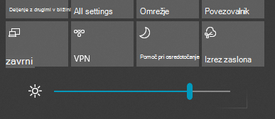

# Spreminjanje svetlosti zaslona v sistemu Windows 10

Če je vaš Windows 10 novejši od različice 1903, ima v središču za opravila **drsnik za svetlost**. Če želite odpreti središče za opravila, kliknite gumb **Obvestilo** na skrajni desni strani opravilne vrstice, ali pa na tipkovnici pritisnite tipki **Windows Home + A**.

Če imate starejšo različico sistema Windows 10, lahko drsnik za svetlost najdete v razdelku **[Nastavitve > Sistem > Zaslon](ms-settings:display?activationSource=GetHelp)**.

**Opombe**:

- Pri namiznih računalnikih z zunanjim monitorjem morda ne boste videli drsnika Spremenite svetlost vgrajenega zaslona. Če želite spremeniti svetlost zunanjega monitorja, uporabite gumbe na monitorju.
- Če nimate namiznega računalnika in drsnik ni prikazan ali deluje, poskusite posodobiti gonilnik zaslona. V iskalno polje v opravilni vrstici vnesite ukaz **Upravitelj naprav** in na seznamu rezultatov izberite **Upravitelj naprav**. V razdelku **Upravitelj naprav** izberite **Adapterji zaslona** in nato izberite to možnost. Pritisnite in pridržite (ali kliknite z desno tipko miške) ima adapterja zaslona in kliknite **Posodobi gonilnik**; nato sledite navodilom.
