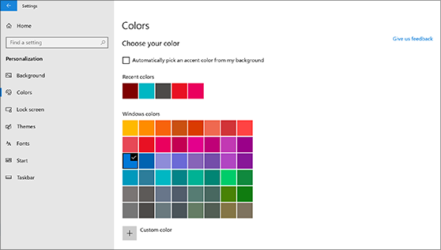
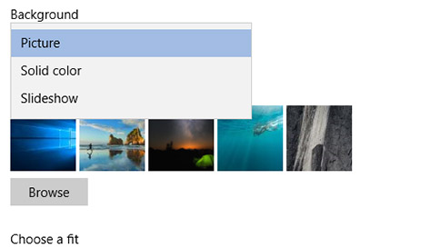

# Spreminjanje ozadja in barv namizja

Če želite spremeniti nastavitev barv, odprite nastavitve **za** > **** > **prilagajanje** > nastavitev**barv in**nato izberite svojo barvo ali pustite, da Windows v ozadju potegne barvo za naglas.

Če želite spremeniti ozadje namizja, pojdite na **Začni** > **** > **prilagajanje** > nastavitev**ozadja**in nato izberite sliko, enobarvno ali ustvarite diaprojekcijo slik. 

Želite več ozadij namizja in barv? Obiščite [trgovino Microsoft Store](https://www.microsoft.com/store/collections/windowsthemes) in izberite več deset brezplačnih tem.
