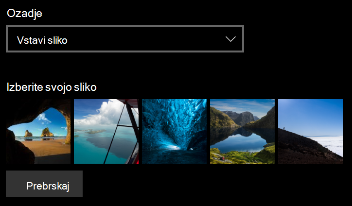

# Spreminjanje ozadja zaklenjenega zaslona

- Iti k **postavljanje** > **poosebljenje** > **zatvornica zaslon**. Ali pa kliknite ali tapnite [tukaj](ms-settings:lockscreen?activationSource=GetHelp).

- Če želite nastaviti sliko za ozadje po meri, izberite **Slika** iz spustnega seznama **ozadje** in izberite ali **prebrskajte** do slike.

  

- Če želite nastaviti diaprojekcijo slik po meri, v spustnem seznamu **ozadje** izberite **diaprojekcijo** in izberite album ali dodajte mapo, ki vsebuje slike za diaprojekcijo.

  
