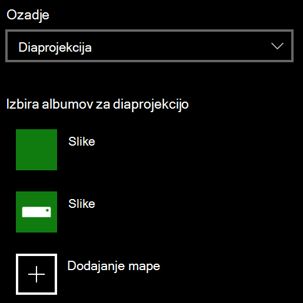

# Spreminjanje ozadja zaklenjenega zaslona

- Pojdite v **Settings**  >  **razdelek**nastavitve  >  **zaklepanja zaslona**. Ali pa kliknite ali tapnite [tukaj](ms-settings:lockscreen?activationSource=GetHelp).

- Če želite nastaviti sliko za ozadje po meri, na spustnem seznamu **ozadje** izberite **Slika** in izberite ali **poiščite** sliko.

  

- Če želite nastaviti diaprojekcijo slik po meri, izberite **diaprojekcijo** na spustnem seznamu **ozadje** in izberite album ali dodajte mapo, ki vsebuje slike za diaprojekcijo.

  
