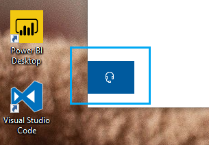

# Povežite se z nami tako, da kliknete gumb za slušalke

Če se želite obrniti na Microsoftovo podporo, v spodnjem levem kotu tega programa kliknite **stik z nami** . V oknu» Fly-Out «boste po izbiri kategorije izdelkov in težav vodili na pravi kanal za podporo.

Z ostalim programom lahko obdržite stike tudi potem, ko ste zagnali sejo» stik z nami «. Podokno» stik z nami «lahko začasno minimirate tako, da v programu kliknete kjer koli drugje. Če se želite vrniti na isto sejo, znova kliknite **stik z nami** .
