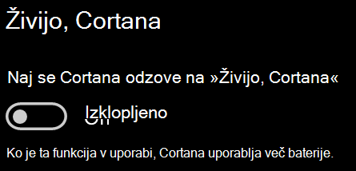

# Cortana se ne pogovarja z mano ali me ne slišiCortana doesn’t talk to me or can’t hear me

Če poskušate uporabiti funkcijo »Hey Cortana«, s katero lahko govorite s Cortano, ne da bi izbrali gumb Cortana v opravilni vrstici ali gumb mikrofona na plošči Cortane, preverite, ali je funkcija omogočena:If you are trying to use the "Hey Cortana" feature, which allows you to talk to Cortana without selecting the Cortana button on the taskbar or the microphone button in the Cortana panel, confirm that the feature is enabled:

1. Odprite začetni **meni**, nato izberite **[Nastavitve > Cortana](ms-settings:cortana?activationSource=GetHelp)**.Go to **Start**, then select **[Settings > Cortana](ms-settings:cortana?activationSource=GetHelp)**.
2. V **razdelku »Živijo, Cortana«** preklopite stikalo Naj se Cortana odziva na **»Hey Cortana«** na **Vklopljeno.**Under **Hey Cortana**, switch the **Let Cortana respond to "Hey Cortana"** toggle to **On**.

**Ali vaše nastavitve zasebnosti preprečujejo Cortani, da bi vas poslušala?****Are your privacy settings preventing Cortana from hearing you?**

Vaše nastavitve zasebnosti lahko preprečijo, da bi se Cortana odzivala na vaš glas.Your privacy settings can prevent Cortana from responding to your voice.
- Preverite, ali je prepoznavanje govora v spletu vklopljeno:Check to make sure Online Speech recognition is turned on:
    - Odprite začetni **meni**, nato pa kliknite **[Nastavitve > za > govor.](ms-settings:privacy-speech?activationSource=GetHelp)**Go to **Start**, then click **[Settings > Privacy > Speech](ms-settings:privacy-speech?activationSource=GetHelp)**.
    - V **razdelku Prepoznavanje govora v** spletu preklopite nastavitev na **Vklopljeno.**Under **Online speech recognition**, switch the setting to **On**.
- Preverite, ali ima Cortana dovoljenje za dostop do vašega mikrofona.Check to make sure Cortana has permission to access your microphone. 
    - Odprite začetni meni, nato pa kliknite **[Nastavitve > nastavitve > Mikrofon.](ms-settings:privacy-microphone?activationSource=GetHelp)**Go to Start, then click **[Settings > Privacy > Microphone](ms-settings:privacy-microphone?activationSource=GetHelp)**.
    - V **razdelku Izberite aplikacije,** ki imajo dostop do vašega **mikrofona** poiščite Cortano na seznamu aplikacij in storitev ter preverite, ali je stikalo **vklopljeno.**Under **Choose which apps can access your microphone**, look for **Cortana** within the list of apps and services and make sure the switch is toggled to **On**.

Poleg tega poskrbite tudi, da so zvočniki ali mikrofoni nastavljeni in delujejo, da boste lahko govorili s Cortano.Moreover, please also make sure that your speakers or microphones are up and working in order to talk to Cortana.
