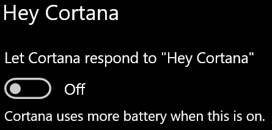

# Cortana ne govori z mano ali me ne sliši

Če poskušate uporabiti funkcijo» Hej Cortana «, ki vam omogoča, da se pogovorite s Cortano, ne da bi izbrali gumb Cortana v opravilni vrstici ali gumb mikrofona na plošči Cortana, potrdite, da je funkcija omogočena:

1. Odprite **Začetni**in nato izberite **[Nastavitve > Cortana](ms-settings:cortana?activationSource=GetHelp)**.
2. Pod **Hej Cortana**, stikalo **naj Cortana odzove na "Hej Cortana"** preklop na **vklopljeno**.

**Ali vaše nastavitve zasebnosti preprečujejo, da bi Cortana vas slišala?**

Nastavitve zasebnosti lahko preprečijo, da se Cortana odzove na vaš glas.
- Preverite, ali je prepoznavanje govora v spletu vklopljeno:
    - Odprite **Začetni**in kliknite **[nastavitve > zasebnost > govor](ms-settings:privacy-speech?activationSource=GetHelp)**.
    - V razdelku **spletno prepoznavanje govora** **vklopite nastavitev.**
- Preverite, ali ima Cortana dovoljenje za dostop do vašega mikrofona. 
    - Odprite začetni in kliknite **[nastavitve > zasebnost > mikrofon](ms-settings:privacy-microphone?activationSource=GetHelp)**.
    - V razdelku **Izberite, katere aplikacije lahko dostopajo do mikrofona**, poiščite **Cortana** na seznamu aplikacij in storitev ter se prepričajte, da je stikalo Preklopljeno na **on**.

Poleg tega se prepričajte, da so vaši zvočniki ali mikrofoni v pripravi in delajo, da bi se pogovarjali s Cortano.
