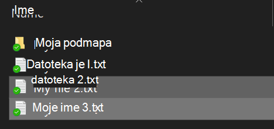
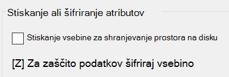

# Šifriranje datotek ali map v sistemu Windows 10

S funkcijo BitLocker lahko šifrirate celoten disk, če pa želite šifrirati le posamezne datoteke ali mape (in njihovo vsebino), morate narediti to:

1. V **raziskovalcu** izberite datoteke/mape, ki jih želite šifrirati. V tem primeru sta bili izbrani dve datoteki:

    

2. Z desno tipko miške kliknite izbrane datoteke, nato pa kliknite **Lastnosti**.

3. V oknu **Lastnosti** kliknite **Dodatno**.

4. V oknu **Dodatne lastnosti** potrdite polje **Šifriraj vsebino za zaščito podatkov**:

    

5. Kliknite **V redu**.
