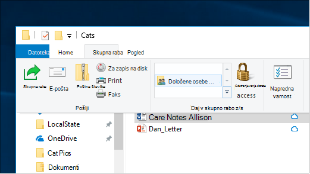
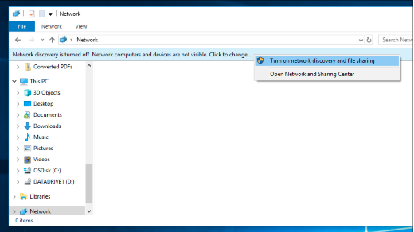

# Skupna raba datotek prek omrežja v sistemu Windows 10File sharing over a network in Windows 10

**Opomba**: Če ste prej uporabili domačo skupino za skupno rabo datotek, upoštevajte, da je bila domača skupina odstranjena iz sistema Windows 10 (različica 1803).**Note**: If you previously used HomeGroup for file sharing, please note that HomeGroup has been removed from Windows 10 (Version 1803). Zdaj lahko omogočite skupno rabo tiskalnikov in datotek z vgrajenimi funkcijami v sistemu Windows 10.You can now share printers and files by using built-in features in Windows 10.

**Skupna raba datotek ali map prek omrežja****To share files or folders over a network**

- V **Raziskovalcu**izberite datoteko > kliknite zavihek **Skupna raba** na vrhu > v razdelku **Skupna raba z** , kliknite **določeni ljudje**.In **File Explorer**, select a file > click the **Share** tab at the top > in the **Share with** section, click **Specific people**.

    
          
- Če izberete več datotek hkrati, jih lahko daste v skupno rabo na enak način.If you select multiple files at once, you can share them all in the same way. Deluje tudi za mape.It works for folders, too.

**Če si želite ogledati naprave v omrežju, ki so v skupni rabi datotek****To see devices on the network that are sharing files**

- V **Raziskovalcu**pojdite v razdelek **omrežje**.In **File Explorer**, go to **Network**. Če odkrivanje omrežja ni omogočeno, se prikaže sporočilo o napaki» odkrivanje omrežja je izklopljeno... «If Network discovery is not enabled, you will see an error message "Network discovery is turned off..."

- Kliknite **odkrivanje omrežja je izklopljen** banner, nato pa kliknite **Vklopi odkrivanje omrežja in skupna raba datotek**.Click the **Network discovery is turned off** banner, then click **Turn on network discovery and file sharing**.

    

[Več informacij o skupni rabi datotek v omrežjuRead more about file sharing over a network](https://support.microsoft.com/help/4092694/windows-10-file-sharing-over-a-network)

[Skupna raba datotek s programi, OneDrive, e-poštnimi sporočili in drugimiShare files using apps, OneDrive, emails, and more](https://support.microsoft.com/help/4027674/windows-10-share-files-in-file-explorer)
