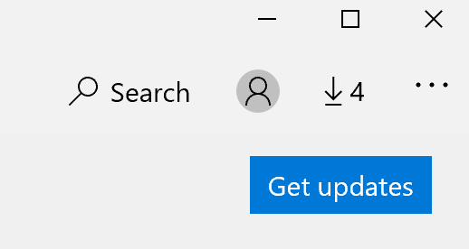

# Popravljanje jezika uporabniškega vmesnika

Ko spremenite jezik uporabniškega vmesnika v sistemu Windows 10, lahko nekateri programi še vedno uporabljajo prejšnji jezik, ko jih odprete. To se zgodi, ker je treba nove različice programov za ta jezik prenesti iz trgovine. To težavo odpravite tako, da počakate na samodejno posodobitev, lahko pa tudi ročno namestite posodobljeno različico aplikacij.

Če želite ročno namestiti posodobitev, odprite **Microsoft Store** in v zgornjem desnem kotu kliknite **prenosi in posodobitve** . Nato kliknite **pridobi posodobitve**. Če se po dokončani posodobitvi jezik ne spremeni, poskusite znova zagnati računalnik.

Če želite več informacij o vnosu in prikazu jezikovnih nastavitev, glejte [upravljanje vnosa in prikaza jezikovnih nastavitev v sistemu Windows 10](https://support.microsoft.com/help/4027670/windows-10-add-and-switch-input-and-display-language-preferences).
