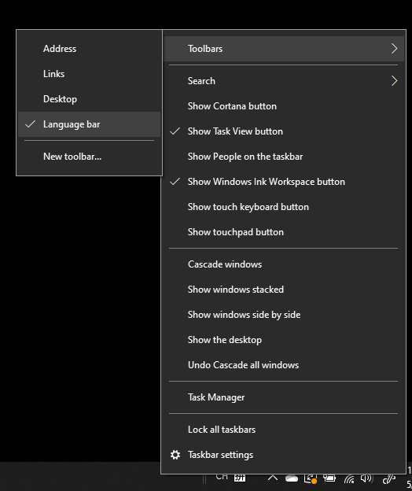

# Skrivanje, prikazovanje ali ponastavitev vrstice z jeziki

**Če želite minimirati vrstico z jeziki:**

Kliknete lahko gumb minimiziraj v zgornjem desnem kotu vrstice z jeziki. Lahko pa vrstico z jeziki povlečete v opravilno vrstico, da jo samodejno minimizirate.

**Če želite iz okna vrstico z jeziki vati:**

Če vrstice z jeziki ne želite zasidstati v opravilni vrstici, z desno  tipko miške kliknite prazen prostor v opravilni vrstici in počistite možnost Vrstica z jeziki v meniju Orodne vrstice. Vrstica z jeziki bo tako prikazana zunaj opravilne vrstice, tako kot prejšnji posnetek zaslona.

**Če želite obnoviti vrstico z jeziki na privzeto nastavitev:**

Z desno tipko miške kliknite gumb jezik v orodni vrstici in nato **v meniju kliknite** Obnovi možnost vrstice z jeziki. S tem boste možnost obnovili na privzeto nastavitev.

