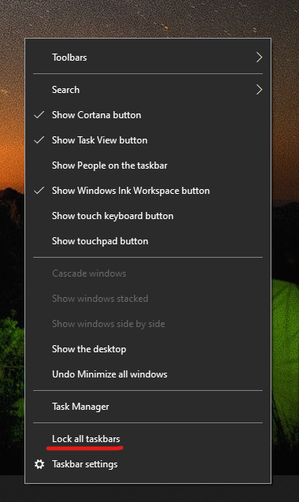

# Premakni opravilno vrstico na stran ali na vrh namizja

Najprej preverite, ali je opravilna vrstica odklenjena. Ali je opravilna vrstica odklenjena preverite tako, da z desno tipko miške kliknete prazen prostor v opravilni vrstici, ter preverite ali je možnost **Zakleni opravilno vrstico in** odkljukana. Če je, to pomeni, da je opravilna vrstica zaklenjena in je ni mogoče premakniti. S klikom na možnost **Zakleni opravilno vrstico** jo boste odklenili in odstranili oznako.

Če imate več monitorjev, ki prikazujejo opravilno vrstico, boste videli možnost **Zakleni vse opravilne vrstice**.

Ko je opravilna vrstica odklenjena, lahko pritisnete in pridržite poljuben prazen prostor v opravilni vrstici ter jo povlečete na želeno mesto na zaslonu. To lahko naredite tudi tako, da z desno tipko miške kliknete prazen prostor v opravilni vrstici in izberete **[Nastavitve opravilne vrstice](ms-settings:taskbar?activationSource=GetHelp) > Mesto opravilne vrstice na zaslonu**.
