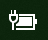
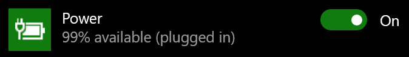

# Manjkajoči ikoni »Napajanje« ali »Baterija« v Windows 10Power or battery icon missing in Windows 10

Če ima vaša naprava s sistemom Windows 10 baterijo (npr. prenosnik ali tablični računalnik ali osebni računalnik, povezan z UPS-jem prek USB-ja), je v opravilni vrstici blizu ure ponavadi prikazana ikona napajanja/baterije, na primer:If your Windows 10 device has a battery (e.g., laptop or tablet, or a PC connected via USB to a UPS), normally a power/battery icon is shown in the taskbar near the clock, for example:

Če ikone ne vidite, je morda skrita:If you don't see this icon, it may be hidden:

1. Pojdite na **[Nastavitve > Prilagajanje > Opravilna vrstica](ms-settings:taskbar?activationSource=GetHelp)**.Go to **[Settings > Personalization > Taskbar](ms-settings:taskbar?activationSource=GetHelp)**.

2. V območju za obvestila kliknite **Izberite, katere ikone naj se prikažejo v opravilni vrstici**.In the Notification area, click **Select which icons appear on the taskbar**.

3. Nato na seznamu poiščite element **Napajanje** in njegovo nastavitev preklopite na **Vklopljeno**.Then find the **Power** item in the list and toggle its setting to **On**.

    

**Odpravljanje težav****Troubleshooting**

Če ste sledili zgornjim navodilom in je preklopni gumb **Napajanje** zatemnjen ali ni viden, v iskalno polje v opravilni vrstici vnesite **upravitelj naprav**, in na seznamu rezultatov izberite **Upravitelj naprav**.If you followed the above instructions and the **Power** toggle is greyed out or not visible, in the search box on the taskbar, type **device manager**, and then select **Device Manager** in the list of results. V razdelku **Baterije**, z desno tipko miške kliknite baterijo za svojo napravo **Onemogoči** in kliknite **Da**.Under **Batteries**, right-click the battery for your device, click **Disable**, and click **Yes**. Počakajte nekaj sekund, nato z desno tipko miške kliknite baterijo in kliknite **Omogoči**.Wait a few seconds, and then right-click the battery and click **Enable**. Znova zaženite napravo.Then restart your device.

Če ste sledili zgornjim navodilom, vendar se ikona akumulatorja ne prikaže v opravilni vrstici, v iskalno polje v opravilni vrstici vtipkajte **upravitelj opravil** in na seznamu rezultatov kliknite **Upravitelj opravil**.If you followed the above instructions, but the battery icon does not appear on the taskbar, in the search box on the taskbar, type **task manager**, and then click **Task Manager** in the list of results. Na zavihku **Postopki** pod **Ime** z desno tipko miške kliknite **Raziskovalec** in nato **Ponovni zagon**.On the **Processes** tab, under **Name**, right-click **Explorer**, and then click **Restart**.
