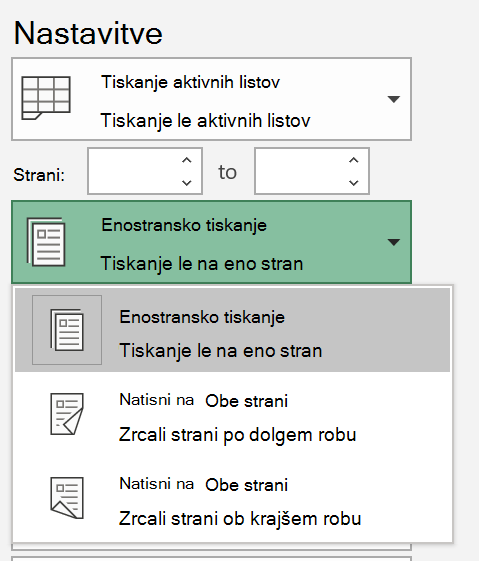
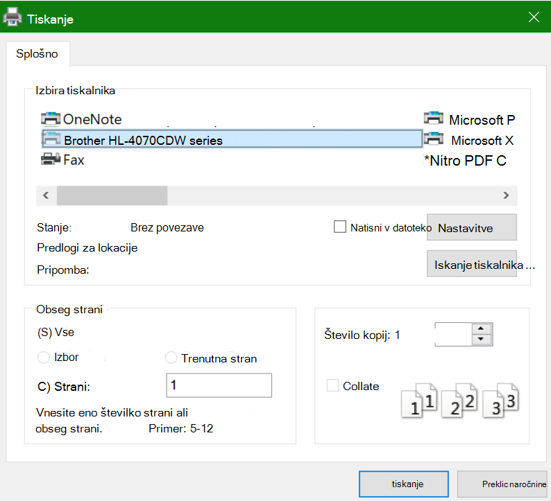

# Tiskanje na obeh straneh papirja (obojestransko tiskanje)Printing on both sides of paper (duplex printing)

**Ali je moj tiskalnik sposoben za obojestransko tiskanje?****Is my printer capable of duplex printing?**

S povzetkom funkcije ali ročnim tiskalnikom naj vam pove, ali je mogoče natisniti na obe strani papirja, imenovano tudi» obojestransko tiskanje «.Your printer’s feature summary or manual should tell you whether it is capable of printing on both sides of the paper, also known as “duplex printing.” Če imate Microsoft Office, lahko na drug način ugotovite tako, da odprete Officeovo aplikacijo, kot je Word ali Excel, **> tiskanje datoteke**, s čimer se prepričajte, da je izbran pravi tiskalnik in iščete zmogljivosti v razdelku Nastavitve.If you have Microsoft Office, another way to find out is by opening an Office app like Word or Excel, going to **File > Print**, making sure the right printer is selected, and looking for the capability in the Settings section. Na primer:For example: 

**Obojestransko tiskanje v sistemu Microsoft Office****Duplex printing in Microsoft Office**

Če je tiskalnik sposoben tiskati na obe strani, ko odprete **datoteko > tiskanje** v Officeovem programu, se prikaže možnost» Natisni na obe strani «, kot je prikazano v zgornjem primeru.If your printer is capable of printing on both sides, when you go to **File > Print** in the Office app, you will see an option to “Print on Both Sides,” as shown in the example above.  Izberite vrsto obojestranskega tiskanja, ki ga želite (zrcali dolgi rob, ali zrcali kratek rob), nato pa kliknite **Natisni** , da zaženete izpis.Select the type of duplex printing you want (flip on long edge, or flip on short edge), and click **Print** to start the printout.

**Obojestransko tiskanje iz katerega koli programa****Duplex printing from any application**

V številnih aplikacijah med tiskanjem se prikaže splošno pogovorno okno za tiskanje, ki je videti tako:In many apps when you print you will see a general print dialog that looks like this: 

Prepričajte se, da je izbran pravi tiskalnik, nato pa kliknite **Nastavitve** , da odprete okno nastavitve tiskalnika.Make sure the right printer is selected, then click **Preferences** to open the printer preferences window. Če je tiskalnik sposoben obojestranskega tiskanja, je možnost, da se to omogoči za trenutno tiskalno opravilo, prikazana v tem oknu.If the printer is capable of duplex printing, the ability to enable this for the current print job will show in that window.
