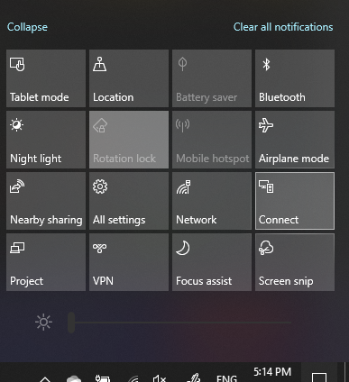

# Project v računalnik s sistemom WindowsProject to a PC

V ciljni napravi (projektiranje) poiščite» nastavitve projekcije «, da odprete stran z nastavitvami za **projektiranje v ta računalnik**.On your destination device (projecting to), search for "Projection Settings" to open the Settings page of **Projecting to this PC**. Prepričajte se, da:Then make sure that:
- » Nekateri Windows in naprave s sistemom Android lahko Project v ta računalnik, ko menite, da je v redu «spustni meni je nastavljen na **vedno izkljuèen**."Some Windows and Android devices can project to this PC when you say it's OK" drop-down menu is set to **Always Off**.
- Spustni meni» Zahtevaj Project to PC «je nastavljen na vsakič, **ko je zahtevana povezava**."Ask to project to this PC" drop-down menu is set to **Every time a connection is required**.
- Spustni meni» Zahtevaj PIN za seznanjanje «je nastavljen na **nikoli**."Require PIN for pairing" drop-down menu is set to **Never**.

V ciljni napravi zaženite aplikacijo **Connect** , tako da **zaženete** in poiščete» Connect «.On your destination device, launch **Connect** app by going to **Start** and search for "Connect".

Nato v izvorni napravi, s katero poskušate Project:Then, on your source device that you are trying to project from:

1. Pritisnite tipko **Windows + A** , da odprete središče za opravila.Press **Windows key + A** to open Action Center.
2. Kliknite **vzpostavi povezavo**.Click **Connect**.
3. Kliknite napravo, na katero želite prestaviti zaslon.Click the device you want to project the screen to.

Po zgornjih korakih mora vaša ciljna naprava prikazati zaslon izvorne naprave, kot da je sekundarni monitor.After the above steps, your destination device should display the screen of the source device as if it is a secondary monitor.
