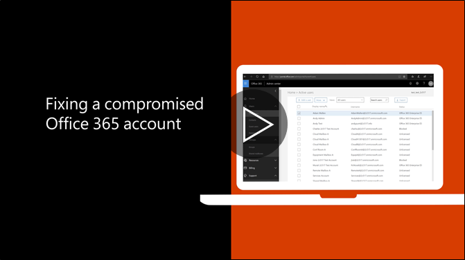

# Priporočnik lestev, da če je ogrožena račun

  
1. [Ponastavitev uporabnikovega gesla](https://support.office.com/article/7a5d073b-7fae-4aa5-8f96-9ecd041aba9c) takoj. Novo geslo prek e-pošte ne sporoči končnemu uporabniku. 
    
2. Odstranite vse sumljive [posredovanje naslovov](https://support.office.com/article/ab5eb117-0f22-4fa7-a662-3a6bdb0add74) v nabiralnik raven. 
    
3. Odstranite vse sumljive [pravila za prejeto pošto](https://support.office.com/article/1433E3A0-7FB0-4999-B536-50E05CB67FED) v poštni nabiralnik. 
    
4. Če uporabnik je blokirano pošiljanje e-pošte, [pojdite na omejen uporabnik račun deblokirati](https://protection.office.com/?hash=/restrictedusers). Nekoč velja, uporabnik bi mogli nadaljevati pošiljanje sporočila v 1 uri.
    
5. Uporabniški račun odstraniti iz koli [upravni vlogo skupine](https://support.office.com/article/eac4d046-1afd-4f1a-85fc-8219c79e1504) , dokler ste prepričani, da račun ni več ogrožena. 
    
Zmanjševanje možnosti podatkov kršitev ali ogrožena račun v prihodnosti, priporočamo branje naše [najboljše prakse člen Office 365 varnost](https://support.office.com/article/9295e396-e53d-49b9-ae9b-0b5828cdedc3).
  

