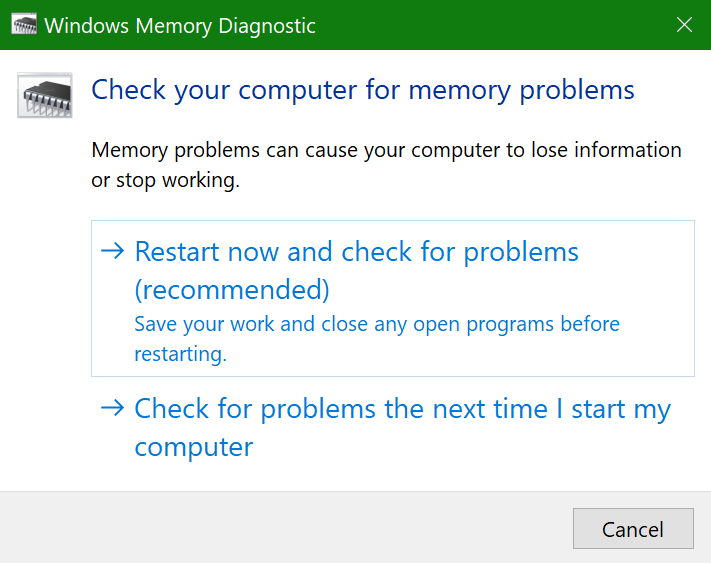
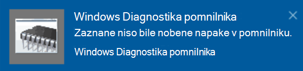

# Zagon diagnostike pomnilnika sistema Windows v sistemu Windows 10

Če se Windows in aplikacije v računalniku zrušijo, zamrznejo ali delujejo nestabilen, imate morda težave s pomnilnikom računalnika (RAM). Zaženete lahko diagnostiko pomnilnika v sistemu Windows in preverite težave z RAM-om računalnika.

V iskalno polje v opravilni vrstici vnesite **diagnostika pomnilnika** in nato izberite **Diagnostika pomnilnika sistema Windows**. 

Če želite zagnati diagnostiko, morate računalnik znova zagnati. Na voljo je možnost za takojšni vnovični zagon (shranite svoje delo in najprej zaprite dokumente in e-poštna sporočila) ali pa načrtujte samodejno izvajanje diagnostike ob naslednjem ponovnem zagonu računalnika:

Ko se računalnik znova zažene, se orodje **za diagnostiko pomnilnika** sistema Windows zažene samodejno. Stanje in napredek bosta prikazana med izvajanjem diagnostike, diagnostiko pa lahko prekličete tako, da pritisnete tipko **ESC** na tipkovnici.

Ko je diagnostika končana, se sistem Windows zažene normalno.
Takoj po ponovnem zagonu, ko se prikaže namizje, se prikaže obvestilo (ob ikoni središča za opravila v opravilni vrstici), ki označuje, ali je prišlo do napak v pomnilniku.  Na primer:

Tukaj je ikona središča za opravila:  

In vzorčno obvestilo: 

Če ste izbrali obvestilo,  lahko izberete ikono središče  za opravila v opravilni vrstici, da prikažete središče za opravila in si ogledate seznam obvestil, po ki se jih lahko premikate.

Če si želite ogledati podrobne informacije, **vnesite** dogodek v iskalno polje v opravilni vrstici, nato pa izberite **Pregledovalnik dogodkov.** V levem **podoknu pregledovalnika** dogodkov se pomaknite v okno Dnevniki **> Windows.** V desnem podoknu preglejte seznam, medtem  ko si ogledujete stolpec Vir, dokler ne vidite dogodkov z vrednostjo Source value **MemoryDiagnostics-Results.** Označite vsak tak dogodek in si oglejte informacije o rezultatu v polju pod **zavihkom** Splošno pod seznamom.
