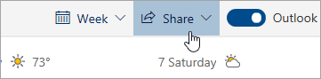

# Deljenje z Outlookom v spletuSharing with Outlook on the web

1. Na dnu strani izberite koledar, če želite iti v koledar.At the bottom of the page, select Calendar to go to Calendar.

2. V koledarju v orodni vrstici na vrhu strani izberite **Skupna raba**in izberite koledar, ki ga želite deliti.In Calendar, on the toolbar at the top of the page, select **Share**, and choose the calendar you want to share. 

    

    **Opomba**: koledarjev, ki so v lasti drugih oseb, ni mogoče deliti.**Note**: You can't share calendars owned by other people.

3. Vnesite ime ali e-poštni naslov osebe, s katero želite deliti koledar.Enter the name or email address of the person you want to share your calendar with.

4. Izberite, kako želite, da oseba uporablja vaš koledar:Choose how you want the person to use your calendar: 
    - **Si lahko ogledate, ko sem zaposlen**   jim omogoča, da vidijo, ko ste zasedeni, vendar ne vključuje podrobnosti, kot je lokacija dogodka.**Can view when I'm busy** lets them see when you're busy but doesn't include details like the event location. 
    - **Si lahko ogledate naslove in lokacije**   jim omogoča, da vidijo, ko ste zasedeni, kot tudi naslov in lokacijo dogodkov.**Can view titles and locations** lets them see when you're busy, as well as the title and location of events. 
    - **Lahko si ogledate vse podrobnosti**   omogoča, da vidijo vse podrobnosti o vaših dogodkih.**Can view all details** lets them see all the details of your events. 
    - **Lahko uredite**   omogoča urejanje koledarja.**Can edit** lets them edit your calendar. 
    - **Delegat**   omogoča urejanje koledarja in skupno rabo z drugimi.**Delegate** lets them edit your calendar and share it with others.

5. Izberite **Skupna raba**.Select **Share**. Če se odločite, da koledarja ne boste delili takoj, izberite **Odstrani**.If you decide not to share your calendar right now, select **Remove**. 

**Opombe**:**Notes**:  

- Ko koledar delite z nekom, ki ne uporablja Outlooka v spletu, na primer nekdo, ki uporablja Gmail, lahko sprejme povabilo z uporabo Microsoftovega 365 ali Outlook.com računa.When sharing your calendar with someone who's not using Outlook on the web, for example, someone using Gmail, they'll only be able to accept the invitation using a Microsoft 365 or an Outlook.com account. 

- Koledarji ICS so samo za branje, tako da tudi če omogočite dostop za urejanje drugim osebam, ne bodo mogli urejati koledarja.ICS calendars are read-only, so even if you grant edit access to other people, they won't be able to edit your calendar. 

- Kako pogosto je vaš ICS koledar sinhronizira odvisna od ponudnika e-pošte osebe, s katero ste ga delili.How often your ICS calendar syncs depends on the email provider of the person you've shared it with. 

- Elementi koledarja, označeni z zasebnimi, so zaščiteni.Calendar items marked private are protected. Večina ljudi, ki jih daste v skupno rabo, vidi samo čas elementov, označenih z zasebnim, ne naslova, lokacije ali drugih podrobnosti.Most people you share your calendar with see only the time of items marked private, not the title, location, or other details. Ponavljajoča se serija, označena kot zasebna, prikaže tudi vzorec ponovitve.Recurring series marked as private will also show the recurrence pattern.
