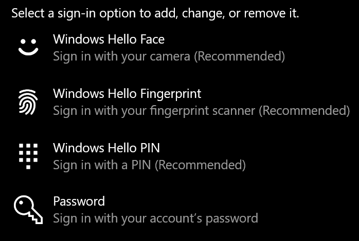
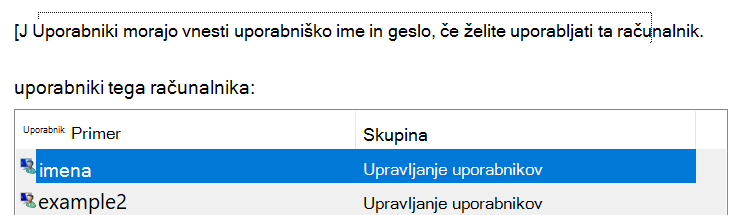

# Vpis v Windows 10 brez gesla

Če se želite izogniti vnosu gesla ob zagonu sistema Windows, priporočamo, da uporabite eno od varnih možnosti vpisa v Windows Hello, kot je koda PIN, prepoznavanje obraza ali prstni odtis, če je na voljo. Če res želite onemogočiti varni vpis, glejte spodnja navodila »Samodejno Windows 10 vpis«.

**Zaščitite Windows Hello nadomestnih možnosti za geslo računa**

Odprite **Nastavitve > računi > možnosti vpisa** (ali kliknite [tukaj).](ms-settings:signinoptions?activationSource=GetHelp) Na seznamu bodo navedene razpoložljive možnosti za vpis. Na primer:

Kliknite ali tapnite eno od možnosti, da jo konfigurirate. Ko naslednjič zaženete ali Windows geslo, boste lahko namesto gesla uporabili novo možnost. 

**Samodejni vpis v Windows 10**

**Opomba:** Samodejni vpis je priročen, vendar predstavlja varnostno tveganje, še posebej, če je vaš računalnik dostopen več ljudem. 

1. Kliknite ali tapnite gumb **za začetni meni** v opravilni vrstici.

2. Vnesite **netplwiz in pritisnite** tipko Enter, da odprete okno Uporabniški računi.

3. V **oknu Uporabniški** računi kliknite račun, v katerega se želite samodejno vpisati ob Windows vpis.

4. Počistite potrditveno polje »Uporabniki morajo vnesti uporabniško ime in geslo, če morajo uporabljati ta računalnik«.

    

5. Kliknite **V redu**. Pozvani boste k vnosu in potrditvi gesla za izbrani račun. Če želite **končati,** kliknite V redu. Ko se Windows 10, se samodejno vpiše v račun, ki ste ga izbrali.
