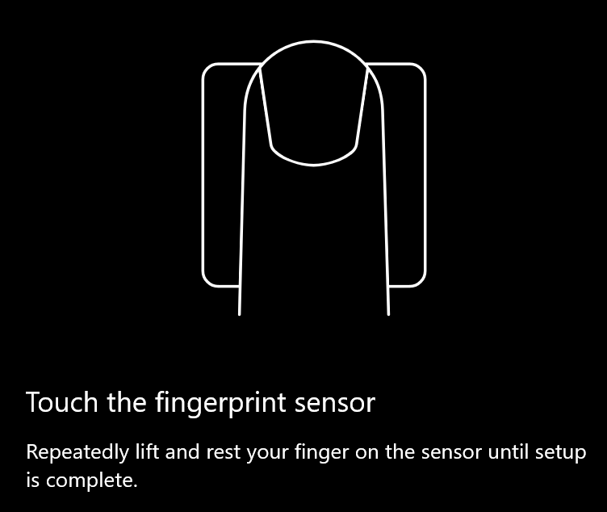
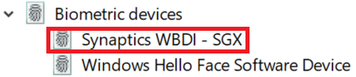

# Možnost odklepanja prstnih odtisov v Windows 10

**Omogočanje Windows Hello prstnih odtisov**

Če želite Windows 10 prstnim odtisom, morate nastaviti prstni odtis Windows Hello tako, da dodate (Windows se naučite prepoznati) vsaj en prst. 

1. Odprite **Nastavitve > računi > možnosti vpisa** (ali kliknite [tukaj).](ms-settings:signinoptions?activationSource=GetHelp) Na seznamu bodo navedene razpoložljive možnosti za vpis. Na primer:

    

2. Kliknite ali **tapnite Windows Hello prstni odtis**, nato pa kliknite **Nastavi**. V Windows Hello kliknite **Uvod.** Senzor prstnih odtisov se bo aktiviral in pozvani boste, da postavite prst na senzor:

   

3. Upoštevajte navodila, ki vas bodo pozvala, da večkrat pregledate prst. Ko bo ta rešitev končana, lahko dodate druge prste, ki jih boste morda želeli uporabiti za vpis. Ko se boste naslednjič v Windows 10, boste imeli možnost, da za to uporabite svoj prstni odtis.

**Windows Hello Možnost za vpis s prstnim odtisom ni na voljo**

Če možnost Windows Hello Fingerprint ni prikazana kot možnost v možnostih vpisa, Windows ne pozna nobenega bralnika prstnih odtisov/optičnega bralnika, ki je priložen računalniku, ali da pravilnik sistema preprečuje njegovo uporabo (če na primer vaš računalnik upravlja vaše delovno mesto). Odpravljanje težav: 

1. Izberite gumb **za začetni** meni v opravilni vrstici in poiščite **Upravitelja naprav**.

2. Kliknite ali tapnite, da odprete **upravitelja naprav.**

3. V upravitelju naprav razširite biometrične naprave tako, da kliknete škarne.

   

4. Optični bralnik za prstni odtis mora biti naveden kot biometrična naprava, kot je optični bralnik Synaptics WBDI:

   

5. Če bralnik prstnih odtisov ni prikazan in je optični bralnik integriran z vašim računalnikom, obiščite spletno mesto izdelovalca računalnika. V razdelku za tehnično podporo za svoj model računalnika poiščite gonilnik Windows 10 optičnega bralnika, ki ga lahko namestite.

6. Če je optični bralnik ločen od računalnika (priključen prek USB-ja), obiščite spletno mesto izdelovalca optičnega bralnika in poiščite ter namestite programsko opremo gonilnika naprave Windows 10 za model optičnega bralnika, ki ga imate.
