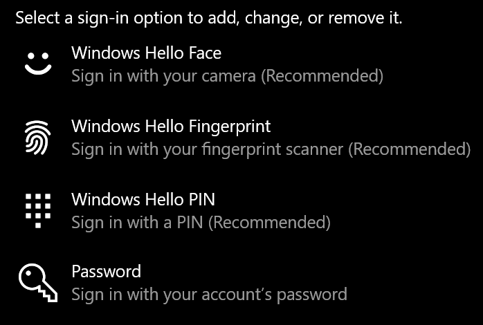

# Uporaba možnosti odklepanja prstnih odtisov v sistemu Windows 10Use fingerprint unlock option in Windows 10

**Omogoči Windows hello prstni odtis****Enable Windows Hello Fingerprint**

Če želite odkleniti sistem Windows 10 s prstnim odtisom, morate nastaviti Windows hello prstni odtis tako, da dodate (dovolite, da se Windows nauči prepoznati) vsaj en prst.To unlock Windows 10 using your fingerprint, you need to set up Windows Hello Fingerprint by adding (letting Windows learn to recognize) at least one finger. 

1. Odprite **možnost nastavitve > računi > možnosti prijave** (ali kliknite [tukaj](ms-settings:signinoptions?activationSource=GetHelp)).Go to **Settings  > Accounts > Sign-in options** (or click [here](ms-settings:signinoptions?activationSource=GetHelp)). Navedene bodo razpoložljive možnosti za vpis.Available sign-in options will be listed. Na primer:For example:

    

2. Kliknite ali tapnite **Windows hello prstni odtis**, nato pa kliknite **Nastavi**.Click or tap **Windows Hello Fingerprint**, then click **Set up**. V oknu z nastavitvami sistema Windows hello kliknite **Začni**.In the Windows Hello setup window, click **Get started**. Senzor prstnih odtisov bo aktiviran in pozvani boste, da Položite prst na senzor:The fingerprint sensor will activate, and you'll be asked to place your finger on the sensor:

   

3. Upoštevajte navodila, ki vas bodo prosila, da večkrat skenirate prst.Follow the instructions, which will ask you to repeatedly scan your finger. Ko končate, boste imeli možnost dodajanja drugih prstov, ki jih boste morda želeli uporabiti za vpis.When this is finished, you'll have the option of adding other fingers you may want to use for sign-in. Ko se boste naslednjič prijavili v sistem Windows 10, boste imeli možnost, da to storite s prstnim odtisom.Next time you sign in to Windows 10, you will have the option of using your fingerprint to do so.

**Windows hello prstni odtis ni na voljo kot možnost prijave****Windows Hello Fingerprint not available as a sign-in option**

Če Windows hello prstni odtis ni prikazan kot možnost v **možnosti prijave**, to pomeni, da Windows ne pozna nobenega bralnika prstnih odtisov/skenerja, priloženega računalniku, ali da sistemska politika preprečuje njegovo uporabo (če na primer vaš računalnik upravlja vaše delovno mesto).If Windows Hello Fingerprint is not shown as an option in **Sign-in options**, it means Windows is not aware of any fingerprint reader/scanner attached to your PC, or that a system policy prevents its use (if for example your PC is managed by your workplace). Za odpravljanje težav:To troubleshoot: 

1. V opravilni vrstici izberite gumb **Start** in poiščite **upravitelja naprav**.Select the **Start** button in the Taskbar and search for **Device Manager**.

2. Kliknite ali tapnite, da odprete **upravitelja naprav**.Click or tap to open **Device Manager**.

3. V upravitelju naprav razširite biometrične naprave tako, da kliknete njegov Chevron.In Device Manager, expand Biometric devices by clicking its chevron.

   

4. Optični bralnik prstnih odtisov mora biti naveden kot biometrična naprava, kot je optični bralnik Synaptics WBDI:Your fingerprint scanner should be listed as a biometric device, such as the Synaptics WBDI scanner:

   

5. Če optični bralnik prstnih odtisov ni prikazan in je optični bralnik vgrajen v računalnik, obiščite spletno mesto izdelovalca računalnika.If your fingerprint scanner is not shown, and the scanner is integrated into your PC, go to the PC manufacturer's website. V razdelku za tehnično podporo za model računalnika poiščite gonilnik za Windows 10 za skener, ki ga lahko namestite.In the technical support section for your PC model, search for a Windows 10 driver for a scanner that you can install.

6. Če je optični bralnik ločen od računalnika (priložen prek USB-ja), obiščite spletno mesto izdelovalca optičnega bralnika, da poiščete in namestite programsko opremo gonilnika naprave Windows 10 za model optičnega bralnika, ki ga imate.If the scanner is separate from the PC (attached via USB), go to the scanner manufacturer's website to find and install Windows 10 device driver software for the scanner model you have.
