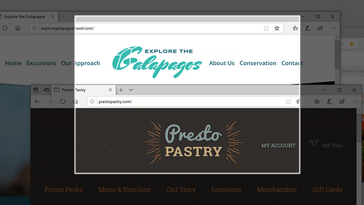
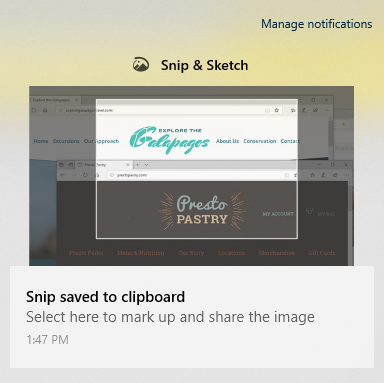

# Uporaba skice & izreza za zajem, označevanje in skupno rabo slik

Skica zaslona se zdaj imenuje **izrez & skica.** **Če želite hitro zasneti izrez:**

1. Pritisnite tipko **Windows + Shift + S**. Zaslon bo potemnjeni, kazalec pa bo prikazan kot križec. 

2. Izberite točko na robu območja, ki ga želite kopirati, in z levo tipko miške kliknite kazalec. 

3. Premaknite kazalec, da označite območje, ki ga želite zajeti. Območje, ki ga zajamete, se prikaže na zaslonu.

   

Slika, ki ste jo izrezali, je shranjena v odložišče, pripravljena za lepljenje v e-poštno sporočilo ali dokument. 

**Če želite urediti ali si ogledati sliko:** 

- Kliknite ikono za obvestila na desni strani opravilne vrstice. nato pa kliknite sliko, ki ste jo pravkar zajeli. Izrez se odpre v aplikaciji Izrez & Skica.

   
