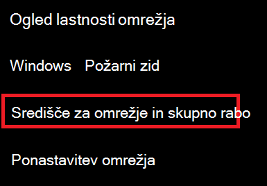
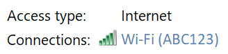
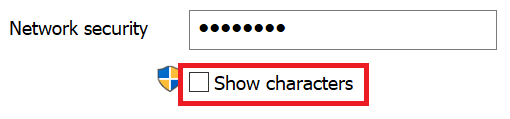

# Ogled Wi-Fi omrežnega gesla v Windows 10

1. Preverite, ali Windows 10 računalnik povezan z omrežjem Wi-Fi povezave.

2. Pojdite v **Nastavitve > Stanje & internetnega** omrežja > ali pa  kliknite ali tapnite tukaj, da vas takoj sprejmemo na to stran.)

3. Kliknite **Središče za omrežje in skupno rabo.**

    

4. V **središču za omrežje** in skupno rabo zraven možnosti **Povezave** boste videli ime brezžičnega omrežja. Če se na primer vaše omrežje imenuje »ABC123«, boste morda videli:

    

    Kliknite ime brezžičnega omrežja, da odprete okno Wi-Fi stanje omrežja. 

5. V oknu Wi-Fi stanje kliknite **Lastnosti brezžičnega omrežja,** nato **zavihek** Varnost in potrdite **polje Pokaži znake.**

    

