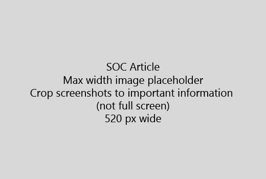

Začetek vaš članek z zelo kratek uvod (1 stavek). Postavi se v bralčevo mesto - zakaj so tukaj? Kaj storiti? 
  
1. Zaslužiti raven k hitri seznam korakov za dokončanje opravila.
    
    Če morate, da pojasni koncept, ali oni življati uganjati predpogoj korake, dodajte kratek povzetek pod korak, kjer jih potrebujejo, in [povezavo](https://support.office.com/article/f37e7984-cf03-4fde-92d3-82970d7e241b.aspx) do koncept ali korake. 
    
2. Vodi postopke kratek - po možnosti 5 ali manj korakov, največ 8.
    
3. Uporabite **slog uporabniškega vmesnika** za elemente uporabniškega vmesnika ali za besedilo ljudi potreba vstopiti. 
    
4. Uporaba glagolov izberite izbrati, ali vnesite kot dejanja in oblikujete menije, kot **meni** \> **ukaz**.
    
5. Po izbiri dodajte screenshot za kontekst (če UI je težko najti, ali je to potrebno za dokončanje naloge).
    
    Največja širina: 520 slikovnih pik. Uporabo standardnih tema, ne kažejo nobenih osebnih podatkov, in pridelek pokazati, le kaj je pomembno. 
    
    
  
Če želite dodati video ali screenshot, uporabite dva stolpca v mreži in korakov v levo in video ali screenshot v desni - glej [ukrepe in video mrežo primer](https://support.office.com/article/14ce8e82-efa0-47f5-bb84-94f078db3dae.aspx). 
  
Cilj več kot 500 besed za članek.
  
# Primer člena

[Spremenite svoj fotografija](https://support.office.com/article/555376e0-1fca-49ba-8434-307a0525c767.aspx)
  

